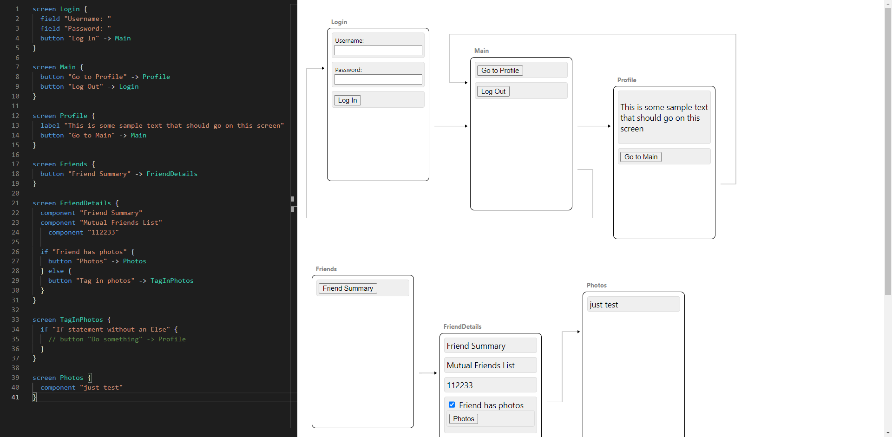

# 面包机

使用 DSL 表达界面原型和页面流

本项目使用 Angular CLI 12.2.7 版本生成。

##  开发服务器

为开发服务器运行 `ng serve` 。导航至 `http://localhost:4200/` 。如果更改任何源文件，应用程序将自动重新加载。

##  代码脚手架

运行 `ng generate component component-name` 生成一个新组件。也可以使用 `ng generate directive|pipe|service|class|guard|interface|enum|module` 。

##  建设

运行 `ng build` 来构建项目。构建工件将存储在 `dist/` 目录中。

##  运行单元测试

运行 `ng test` 通过 Karma 执行单元测试。

##  运行端到端测试

运行 `ng e2e` 可通过您选择的平台执行端到端测试。要使用此命令，首先需要添加一个实现端到端测试功能的软件包。

##  更多帮助

要获得有关 Angular CLI 的更多帮助，请使用 `ng help` 或查看 Angular CLI 概述和命令参考页面。
